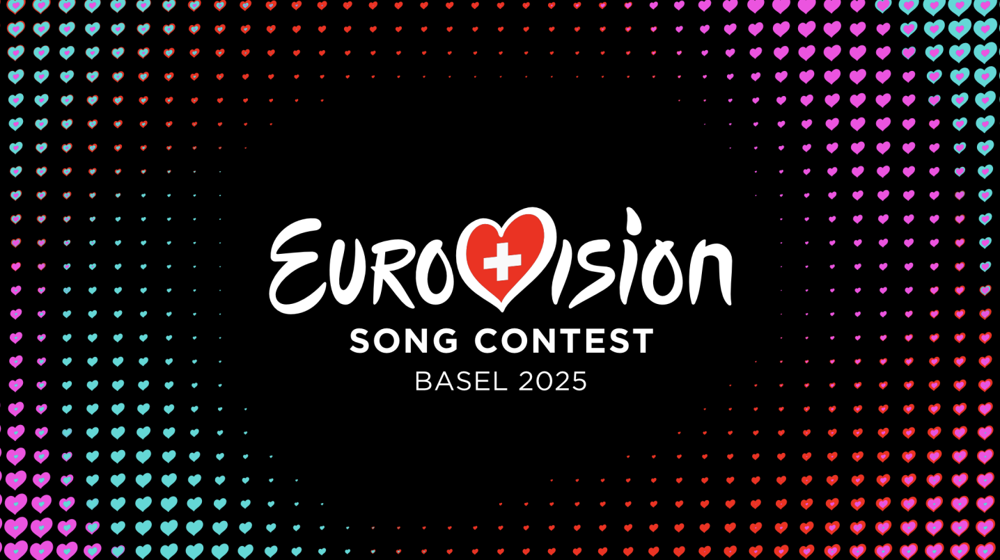
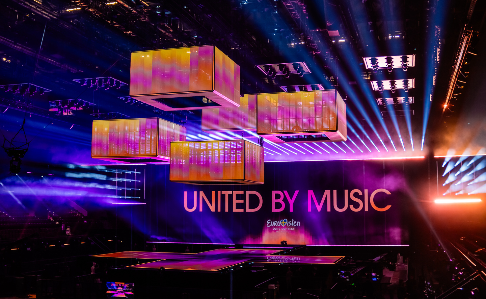
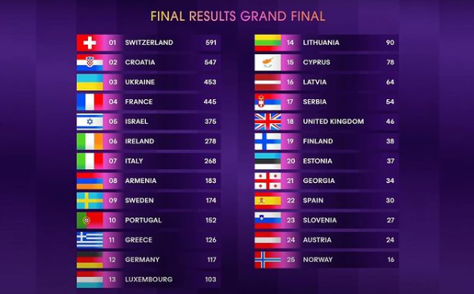

# Background

This document explains the concepts, rules and vocabulary for the *Europhonium* project's domain: the Eurovision Song Contest, 2016-present.

- [Background](#background)
  - [What is Eurovision?](#what-is-eurovision)
  - [Major domain entity types](#major-domain-entity-types)
    - [Countries](#countries)
    - [Contests](#contests)
      - [Stockholm rules (2016-2022)](#stockholm-rules-2016-2022)
      - [Liverpool rules (2023-present)](#liverpool-rules-2023-present)
    - [Broadcasts](#broadcasts)
  - [The future](#the-future)

## What is Eurovision?

The [Eurovision Song Contest](https://eurovision.tv/about/how-it-works) is an annual televised song competition organized by the European Broadcasting Union (EBU). The contest is between national broadcasters, each representing a different country.

|  |
|:------------------------------------------------------------------------------------------------:|
|            The logo for the 2025 Eurovision Song Contest in Basel, Switzerland (EBU).            |

Broadcasters, performers, songs, performances and votes in any edition of the Eurovision Song Contest are all identified by their country of origin. For example:

- "Sweden and Ireland have won Eurovision the most times."
- "In the 2023 grand final, Austria performed first in the running order and finished 15th with 120 points."
- "The UK received zero points from the televote in the 2024 grand final."
- "When Sweden gets 12 points from Norway, that's merely just good taste."
- "Luxembourg participated in Eurovision 2024, for the first time since 1993."

## Major domain entity types

Three major entity types are established in the domain: **countries**, **contests** and **broadcasts**.

### Countries

Many **countries** have participated in Eurovision. They are mostly, but not exclusively, located geographically in Europe. Exceptions include Israel, Australia, Azerbaijan, Georgia and Armenia.

The **"Big Five"** are the five countries that have the largest populations and make the biggest financial contributions to the contest. They are: France, Germany, Italy, Spain and the United Kingdom.

### Contests

A given year's **contest** has between 35 and 45 **participants**, each of which is a country represented by a performer with a song. The contest consists of three broadcasts: two semi-finals and a grand final.

Out of the participants in a contest, the Big Five automatically qualify for the grand final, along with the previous year's winning country. The other participants compete for a grand final place in one of the two semi-finals.

|  |
|:----------------------------------------------------------------------------------------------------------:|
|     The stage for the 68th Eurovision Song Contest in Malm&ouml;, Sweden, 2024 (Peppe Andersson, SVT).     |

The top 10 finishing countries in the two semi-finals go on to compete in the grand final along with the automatic qualifiers. The country that finishes in 1st place in the grand final is the overall contest winner and normally hosts the next year's contest.

|  |
|:-------------------------------------------------------------------------------------------------------------------:|
|      Switzerland wins the 68th Eurovision Song Contest with the song The Code by Nemo (Corinne Cumming, EBU).       |

In the 2024 contest, the Netherlands was one of the top 10 finishing countries in the second semi-final but was subsequently disqualified from the grand final. This is the only time this has happened.

The contest **voting rules** are modified every few years. The *Europhonium* project is restricted to the following two rules sets, which determine the **voting roles** of each participating country in each constituent **broadcast** of the contest:

#### Stockholm rules (2016-2022)

- The participants are split between the two semi-finals for voting and competing purposes.
- Every participating country votes in the grand final.
- All three contest stages use jury voting and televote voting.

#### Liverpool rules (2023-present)

- The competing participants are split between the two semi-finals for voting and competing purposes.
- Every participating country votes in the grand final.
- The semi-finals use televote voting only.
- The grand final uses jury voting and televote voting.
- There is an additional "Rest of the World" non-competing participant, which awards televote points only in all three constituent broadcasts.

### Broadcasts

A given **broadcast** has a number of **competitors**: between 15 and 20 for a semi-final and 25-26 for a grand final. The competitors perform their songs on stage in a pre-determined order.

The broadcast also has a number of **voters**, which award points to the competitors to determine the finishing order of the broadcast.

A voting country awards points by ranking every competing country *excluding itself* from first to last. The top ten ranked competitors receive 12, 10, 8, 7, 6, 5, 4, 3, 2 and 1 points from that voting country; the remainder receive 0 points from that country. Two voting methods are used: **jury** and/or **televote**.

The **finishing order** of the competitors in a broadcast is determined using the following rules, so that there are no ties:

1. The competitors are ordered by descending total points.
2. If there is a tie, the competitor with greater televote points wins the tie.
3. If there is still a tie, the competitor that received non-zero points awards from more voters wins the tie.
4. If there is still a tie, a "count-back" is used: the competitor that received 12-points televote awards from more voters wins the tie, then 10-points televote awards, and so on down to 1-point televote awards.
5. Finally, if there is still a tie, the competitor that performed earlier in the running order wins the tie.

|  |
|:------------------------------------------------------------------------------------:|
|                      The final results of the 2024 Grand Final.                      |

## The future

At the time of development, no rule or format changes have been announced for the forthcoming 2025 edition of the Eurovision Song Contest. The system is developed for the "Stockholm" and "Liverpool" rules only.

|  |
|:-----------------------------------------------------------------------------------------------------------------------------:|
|             Rendering of the stage design for the 2025 Eurovision Song Contest in Basel, Switzerland (SRG / SSR).             |
