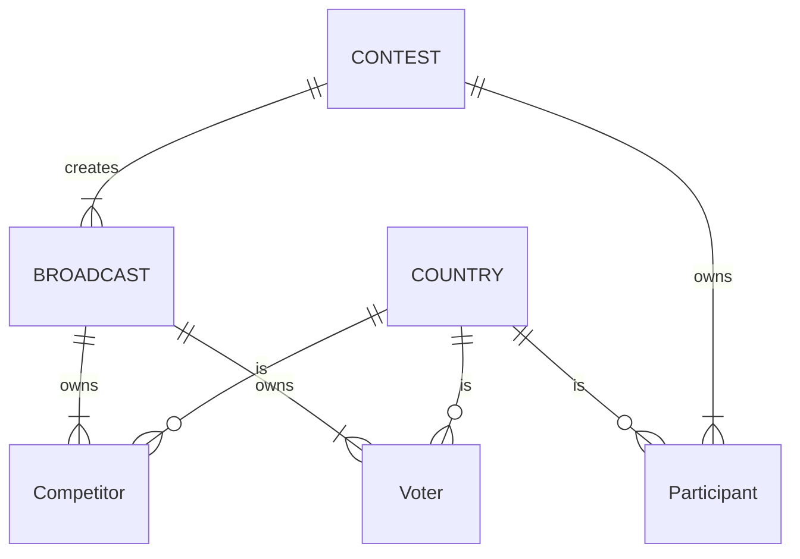
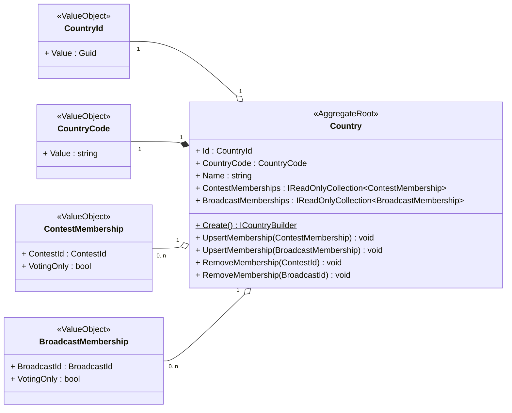
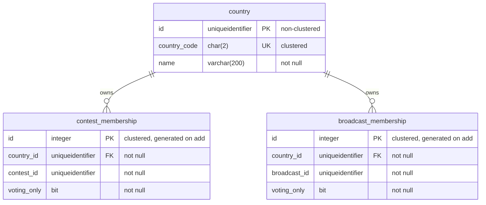
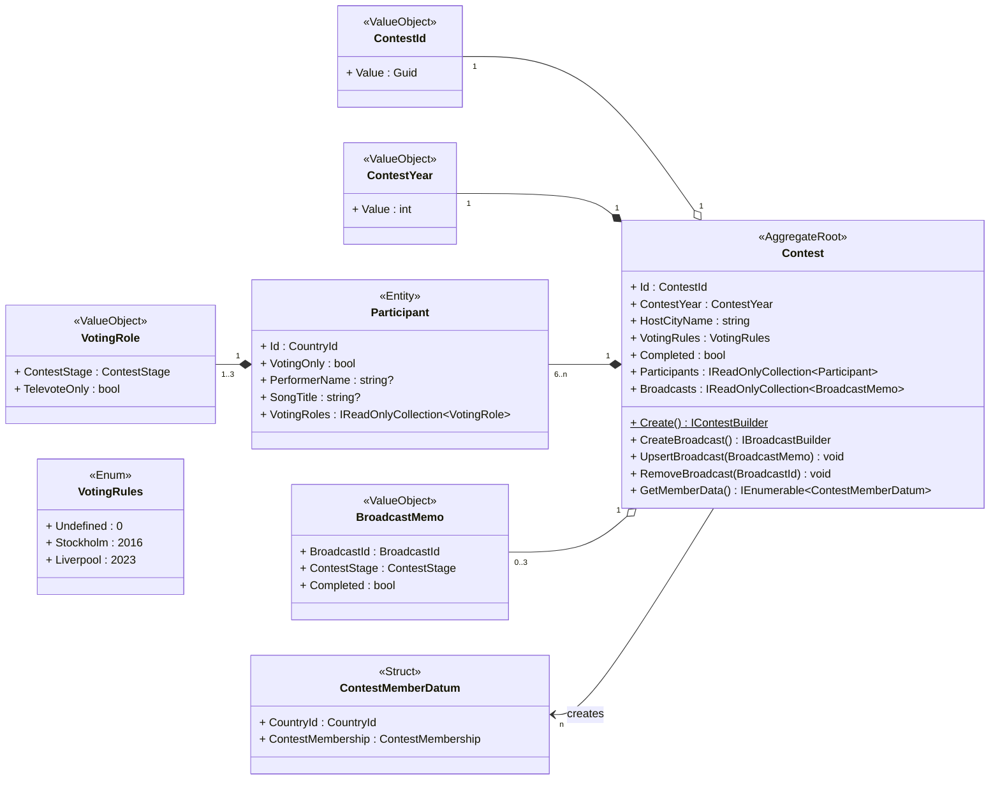
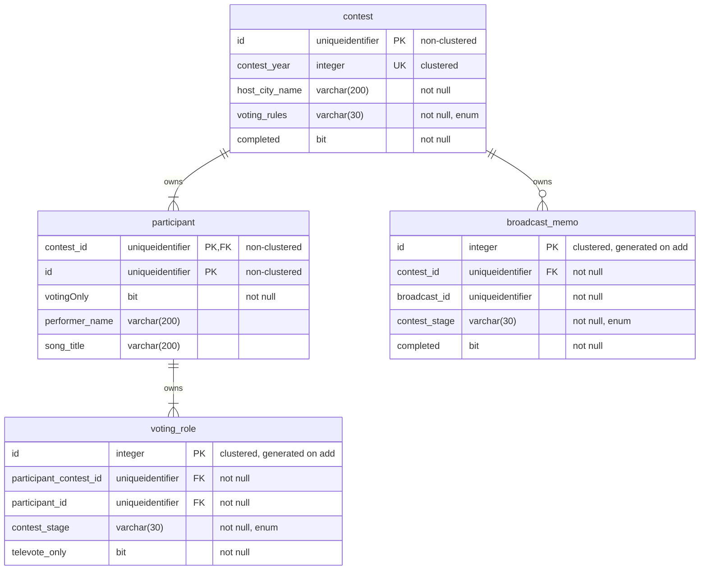
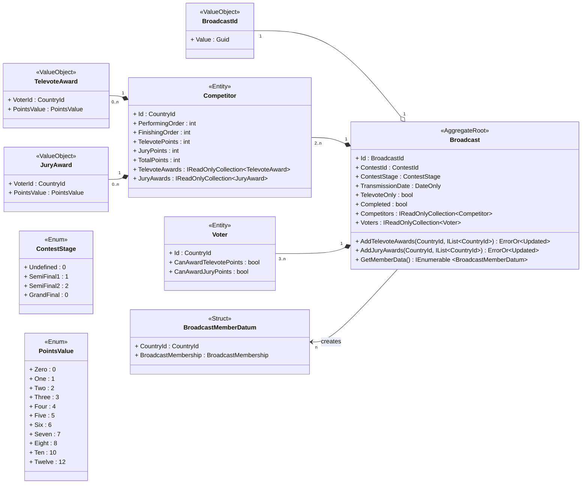
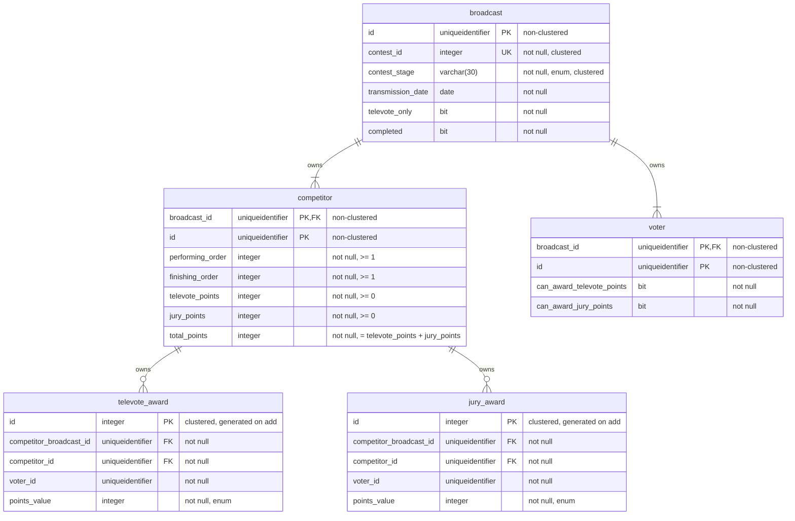

# Domain model

This document outlines the domain model for the *Europhonium* project.

- [Domain model](#domain-model)
  - [Entities and Aggregates](#entities-and-aggregates)
  - [Country aggregate](#country-aggregate)
    - [Country aggregate types](#country-aggregate-types)
    - [Country aggregate key invariants](#country-aggregate-key-invariants)
    - [Country aggregate database schema](#country-aggregate-database-schema)
  - [Contest aggregate](#contest-aggregate)
    - [Contest aggregate types](#contest-aggregate-types)
    - [Contest aggregate key invariants](#contest-aggregate-key-invariants)
    - [Contest aggregate database schema](#contest-aggregate-database-schema)
  - [Broadcast aggregate](#broadcast-aggregate)
    - [Broadcast aggregate types](#broadcast-aggregate-types)
    - [Broadcast aggregate key invariants](#broadcast-aggregate-key-invariants)
    - [Broadcast aggregate database schema](#broadcast-aggregate-database-schema)

## Entities and Aggregates

The domain comprises 6 entity types, of which 3 are aggregates.

- A **COUNTRY** aggregate represents a specific country that exists in the world.
  - A **COUNTRY** aggregate is responsible for tracking its membership of **CONTEST** and **BROADCAST** aggregates.
- A **CONTEST** aggregate represents a specific year's edition of the Eurovision Song Contest.
  - A **CONTEST** aggregate is responsible for creating its constituent **BROADCAST** aggregates and tracking their completion status.
- A **BROADCAST** aggregate represents a competitive broadcast transmitted as a specific stage of a specific contest.
  - A **BROADCAST** aggregate is responsible for accumulating the points awarded in the broadcast and reporting its completion status.
- A **Participant** entity represents a specific country that participates in a specific contest.
- A **Competitor** entity represents a specific country that competes in a specific broadcast.
- A **Voter** entity represents a specific country that votes in a specific broadcast.

The key relationships between the entity types are shown in the diagram below:

- A single **CONTEST** aggregate creates one or more **BROADCAST** aggregates in the system.
- A single **CONTEST** aggregate owns multiple **Participant** entities.
- A single **BROADCAST** aggregate owns multiple **Competitor** entities.
- A single **BROADCAST** aggregate owns multiple **Voter** entities.
- A single **COUNTRY** aggregate is zero or more **Participant** entities in the system.
- A single **COUNTRY** aggregate is zero or more **Competitor** entities in the system.
- A single **COUNTRY** aggregate is zero or more **Voter** entities in the system.

## Country aggregate

### Country aggregate types

### Country aggregate key invariants

- A `Country`'s `Id` is its system-wide unique identifier.
- Every `Country` in the system has a different `CountryCode`.
- A `Country` cannot be deleted from the system if its `ContestMemberships` collection is not empty *or* its `BroadcastMemberships` collection is not empty.
- If an item is added to a `Country`'s `ContestMemberships` collection with the same `ContestId` as an existing item, it replaces the existing item in the collection.
- If an item is added to a `Country`'s `BroadcastMemberships` collection with the same `BroadcastId` as an existing item, it replaces the existing item in the collection.
- A `CountryCode`'s `Value` is a string of 2 upper-case letters.

### Country aggregate database schema

**Additional constraints:**

| Table                | Details                              |
|:---------------------|:-------------------------------------|
| broadcast_membership | (country_id, broadcast_id) is unique |
| contest_membership   | (country_id, contest_id) is unique   |

## Contest aggregate

### Contest aggregate types

### Contest aggregate key invariants

- A `Contest`'s `Id` is its system-wide unique identifier.
- Every `Contest` in the system has a different `ContestYear`.
- A `Contest` cannot be deleted from the system if its `Broadcasts` collection is not empty.
- A `Contest` has at least 6 `Participants`, each of which has a different `Id` referencing an existing `Country` aggregate.
- A `Contest`'s `Participants` must have at least 3 voting in each contest stage.
- If an item is added to a `Contest`'s `Broadcasts` collection with the same `BroadcastId` as an existing item, it replaces the existing item in the collection.
- Every time a `Contest`'s `Broadcasts` collection is updated, its `Completed` property is set to `true` if the `Broadcasts` collection contains three items all of which have `Completed` = `true`, otherwise it is set to `false`.
- A `ContestYear`'s `Value` is an integer in the range \[2016, 2015\].

### Contest aggregate database schema

**Additional constraints:**

| Table          | Details                                                           |
|:---------------|:------------------------------------------------------------------|
| broadcast_memo | (contest_id, contest_stage) is unique                             |
| voting_role    | (participant_contest_id, participant_id, contest_stage) is unique |

## Broadcast aggregate

### Broadcast aggregate types

### Broadcast aggregate key invariants

- A `Broadcast`'s `Id` is its system-wide unique identifier.
- Every `Broadcast` in the system has a different (`ContestId`, `ContestStage`) tuple.
- A `Broadcast` has at least 3 `Voters`, each of which has a different `Id`.
- A `Broadcast` has at least 2 `Competitors`, each of which has a different `Id` matching one of its `Voters`.
- Every time a set of televote/jury points is awarded in a `Broadcast`, the `FinishingOrder` values of all its `Competitors` are updated.
- A `Broadcast` sets its `Completed` value to `true` once all its `Voters` have `CanAwardTelevotePoints` = `false` and `CanAwardJuryPoints` = `false`.
- A `Voter` awards a set of points by ranking all the `Competitors` except the one with the same `Id` as itself (if present).

### Broadcast aggregate database schema

**Additional constraints:**

| Table          | Details                                                      |
|:---------------|:-------------------------------------------------------------|
| competitor     | (broadcast_id, performing_order) is unique                   |
| televote_award | (competitor_broadcast_id, competitor_id, voter_id) is unique |
| televote_award | competitor_id &ne; voter_id                                  |
| jury_award     | (competitor_broadcast_id, competitor_id, voter_id) is unique |
| jury_award     | competitor_id &ne; voter_id                                  |
