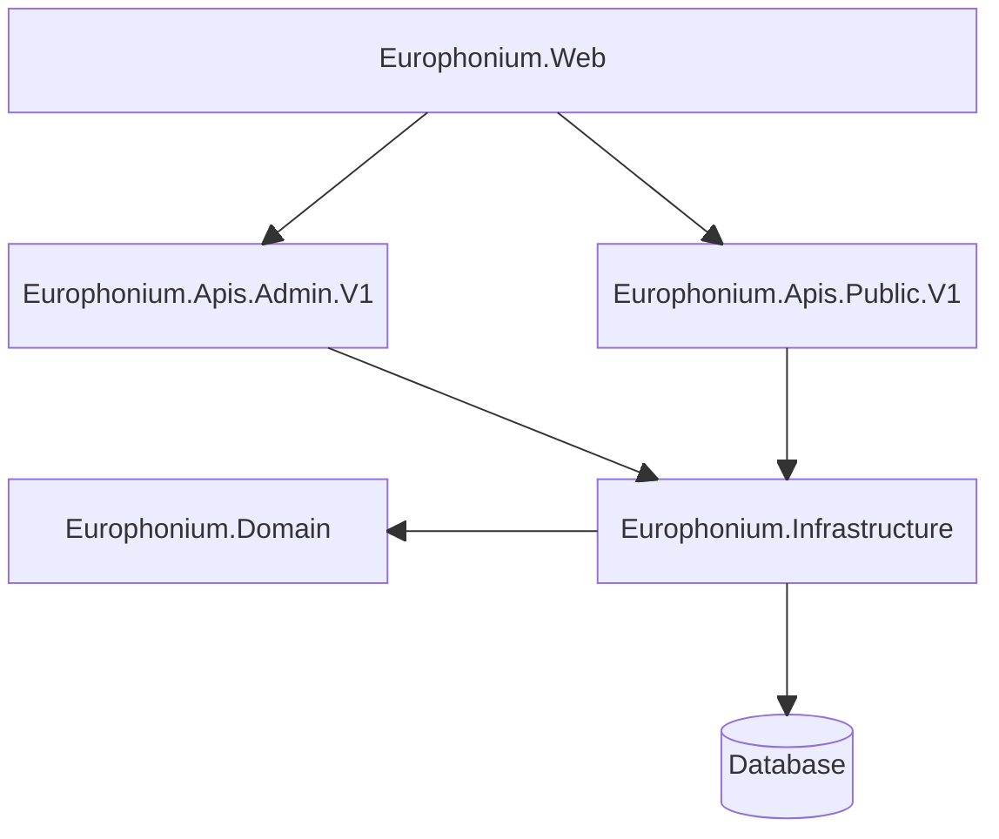

# System design

This document outlines the key design decisions for the *Europhonium project*

- [System design](#system-design)
  - [Level 2 REST maturity](#level-2-rest-maturity)
  - [Modular system architecture](#modular-system-architecture)
  - [REPR pattern](#repr-pattern)
  - [Railway oriented programming](#railway-oriented-programming)
  - [Vertical slice feature files](#vertical-slice-feature-files)
  - [Version control](#version-control)

## Level 2 REST maturity

The system aims for **level 2 REST maturity**. It does not implement hypermedia navigation.

## Modular system architecture

The system is built using a **modular system architecture**. It is composed of 5 assemblies, with dependencies shown in the below diagram.



The `Europhonium.Web` assembly is a .NET Web API project. It contains the web application executable, startup configuration, and request pipeline middleware.

The `Europhonium.Domain` assembly is a .NET Class Library project containing the domain types for the system. This assembly depends on no other assemblies.

The `Europhonium.Infrastructure` assembly is a .NET Class Library project containing internal (i.e. non-middleware) services and settings to be used across the entire system. Most importantly, this assembly contains the data access services for the system.

**Each major version of each API is a separate module.** The API version module is implemented as a .NET Class Library project that depends on the `Europhonium.Infrastructure` assembly and is itself a dependency of the `Europhonium.Web` executable assembly.

## REPR pattern

The APIs are implemented using the **"Request, Endpoint, Response (REPR) pattern"**. Each endpoint is a separate class, with its own request and/or response types.

## Railway oriented programming

Every endpoint is structured using **railway oriented programming**. An incoming HTTP request is mapped to an application command/query object and dispatched to the application pipeline for handling. Its handler returns *either* an instance of the successful result type *or* an `Error`. The HTTP response is *either* have a successful status code and the serialized response object mapped from the application result *or* have an unsuccessful status code with a serialized `ProblemDetails` object mapped from the `Error`.

## Vertical slice feature files

Within a Module, each feature is implemented as a **vertical slice** using one file per feature. The example below illustrates a typical feature file.

```cs
public static class GetCountries
{
  // Globally unique endpoint name
  internal static readonly string EndpointName = typeof(GetCountries).FullName!;

  // Handles an HTTP request to the endpoint
  public async Task<Results<Ok<Response>, ProblemHttpResult>> ExecuteAsync(ISender sender, CancellationToken ct) {}

  // Response object type
  public sealed record Response {}

  // Application query type
  private sealed record Query : IRequest<ErrorOr<CountryResource>> {}

  // Application query handler type
  private sealed class Handler : IRequestHandler<Query, ErrorOr<CountryResource>> {}

  // Maps the endpoint route to the API minor version endpoint route group
  internal static IEndpointRouteBuilder MapGetCountries(this IEndpointRouteBuilder b) {}
}
```

The feature itself is a public static class. Its only public members are:

- its `Request` and/or `Response` types,
- its static `ExecuteAsync` method.

## Version control

Git commit messages adhere to the [Conventional Commits](https://www.conventionalcommits.org/en/v1.0.0/) standard.
