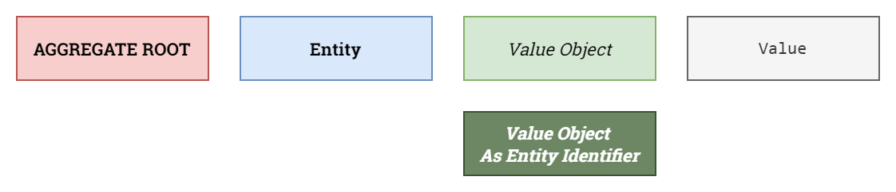
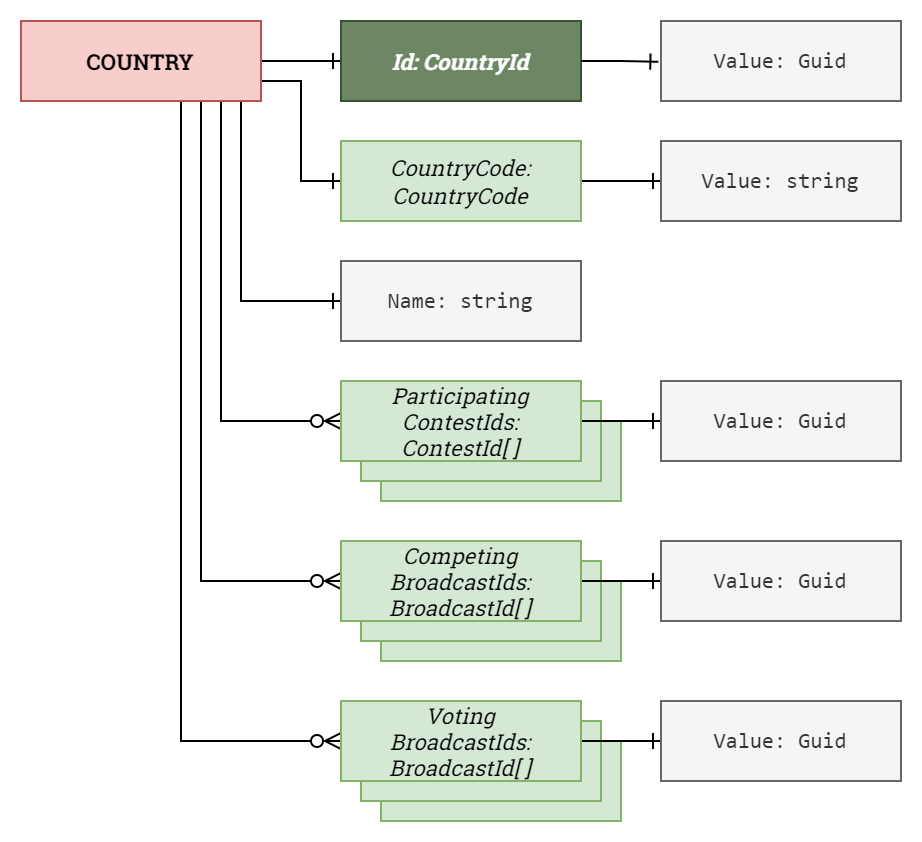
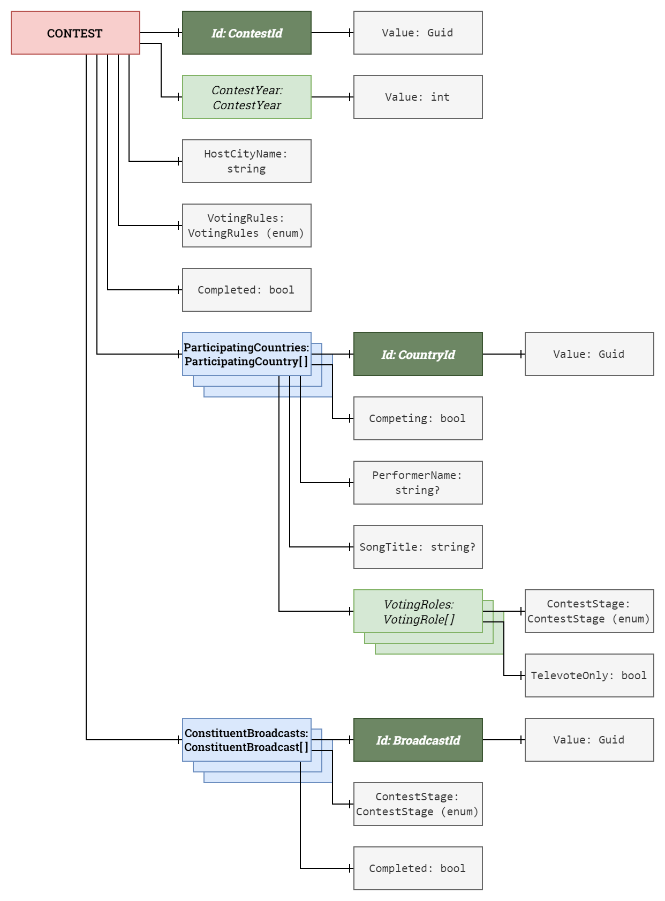
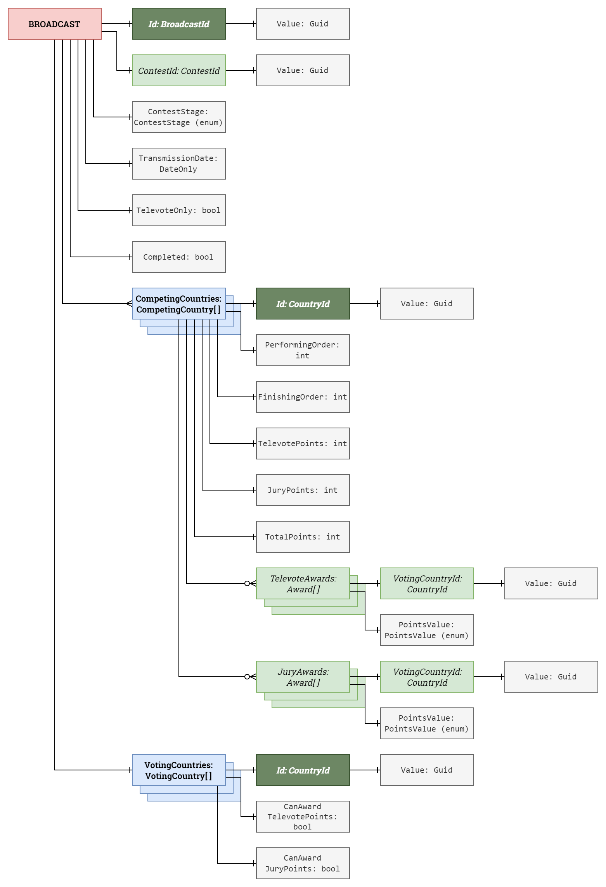

# Domain model

This document outlines the domain model for the *Europhonium* project.

- [Domain model](#domain-model)
  - [Colour scheme](#colour-scheme)
  - [Enums](#enums)
    - [`ContestStage` enum](#conteststage-enum)
    - [`PointsValue` enum](#pointsvalue-enum)
    - [`VotingMethod` enum](#votingmethod-enum)
    - [`VotingRules` enum](#votingrules-enum)
  - [Domain aggregates](#domain-aggregates)
    - [Country aggregate](#country-aggregate)
    - [Contest aggregate](#contest-aggregate)
    - [Broadcast aggregate](#broadcast-aggregate)

## Colour scheme

The diagrams in this document use the colour scheme reproduced below.

|  |
|:--------------------------------------------------------------------:|
|                     Domain model: colour scheme.                     |

## Enums

The following enums are defined.

### `ContestStage` enum

This enum specifies the stage of a contest. The `Undefined` value indicates the absence of a value and should never be used.

```cs
public enum ContestStage
{
  Undefined = 0,
  SemiFinal1 = 1,
  SemiFinal2 = 2,
  GrandFinal = 3
}
```

### `PointsValue` enum

This enum specifies the value of a single points award.

```cs
public enum PointsValue
{
  Zero = 0,
  One = 1,
  Two = 2,
  Three = 3,
  Four = 4,
  Five = 5,
  Six = 6,
  Seven = 7,
  Eight = 8,
  Ten = 10,
  Twelve = 12
}
```

### `VotingMethod` enum

This enum specifies the voting method for points awards to be queried. The `Undefined` value indicates that both voting methods are to be included in the query.

```cs
public enum VotingMethod
{
  Undefined = 0,
  Televote = 1,
  Jury = 2
}
```

### `VotingRules` enum

This enum specifies the voting rules for a contest. The `Undefined` value indicates the absence of a value and should never be used.

```cs
public enum VotingRules
{
  Undefined = 0,
  Stockholm = 2016,
  Liverpool = 2023
}
```

## Domain aggregates

The domain comprises three aggregates: **Countries**, **Contests** and **Broadcasts**.

### Country aggregate

A **Country** aggregate represents a specific country or pseudo-country that exists in the system. A **Country** aggregate is responsible for tracking its country's involvement in **Contest** and **Broadcast** aggregates.

|  |
|:----------------------------------------------------------------------------:|
|                       Domain model: country aggregate.                       |

**Key invariants**

1. A **Country** is uniquely identified in the system by its `Id`.
2. Every **Country** in the system has a unique `CountryCode`.
3. A **Country** cannot be deleted from the system if any of its `ParticipatingContestIds` collection, its `CompetingBroadcastIds` collection, and its `VotingBroadcastIds` collection is not empty.
4. A **CountryCode**'s `Value` is a string of 2 upper-case letters.

### Contest aggregate

A **Contest** aggregate represents a specific year's Eurovision Song Contest edition that exists in the system. A **Contest** aggregate is responsible for creating **Broadcast** aggregates and tracking their completion.

|  |
|:----------------------------------------------------------------------------:|
|                       Domain model: contest aggregate.                       |

**Key invariants**

1. A **Contest** is uniquely identified in the system by its `Id`.
2. Every **Contest** in the system has a unique `ContestYear`.
3. A **Contest** cannot be deleted from the system if its `ConstituentBroadcasts` collection is not empty.
4. A **Contest** has at least 4 `ParticipatingCountries`, of which:
   1. at least 2 must be competing and voting in `SemiFinal1`, and
   2. at least 2 must be competing and voting in `SemiFinal2`.
5. A **ContestYear**'s `Value` is an integer in the range \[2016, 2050\].

### Broadcast aggregate

A **Broadcast** aggregate represents a specific broadcast in a specific year's Eurovision Song Contest edition. A **Broadcast** aggregate is responsible for awarding points from its voting countries to its competing countries and keeping the latter's finishing positions up to date.

|  |
|:--------------------------------------------------------------------------------:|
|                        Domain model: broadcast aggregate.                        |

**Key invariants**

1. A **Broadcast** is uniquely identified in the system by its `Id`.
2. Every **Broadcast** in the system has a unique (`ContestId`, `ContestStage`) tuple.
3. A **CompetingCountry**'s `TotalPoints` value is always equal to the sum of its `TelevotePoints` and `JuryPoints` values.
4. A **VotingCountry** cannot award points to a **CompetingCountry** with the same `Id`.
