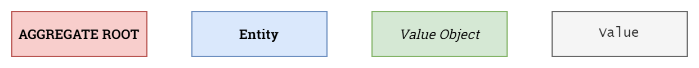
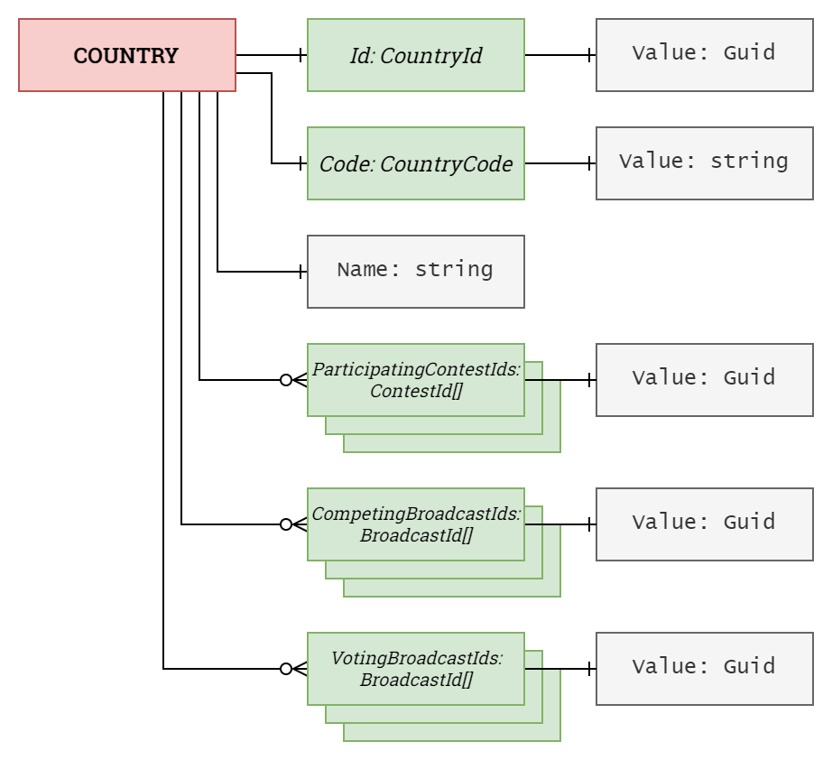
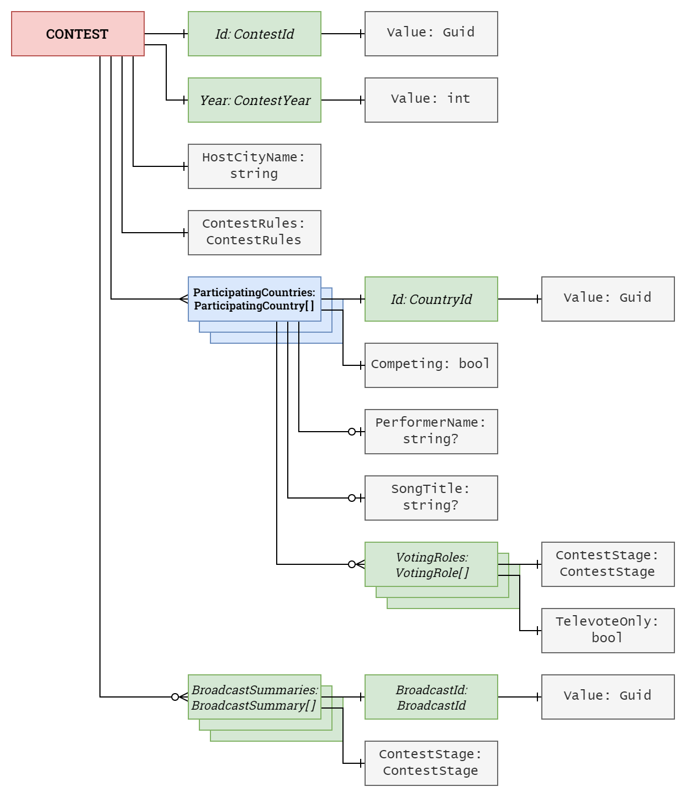
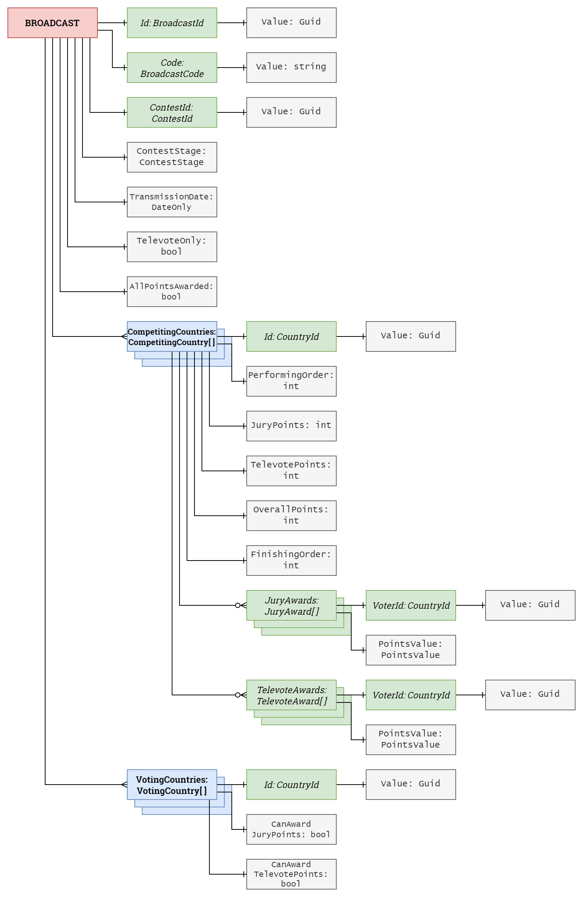

# Domain model

This document outlines the domain model for the *Europhonium* project.

- [Domain model](#domain-model)
  - [Preamble](#preamble)
  - [Countries subdomain](#countries-subdomain)
  - [Contests subdomain](#contests-subdomain)
  - [Broadcasts subdomain](#broadcasts-subdomain)
  - [Enums](#enums)
    - [`ContestStage` enum](#conteststage-enum)
    - [`AllocatedSemiFinal` enum](#allocatedsemifinal-enum)
    - [`ContestRules` enum](#contestrules-enum)
    - [`PointsValue` enum](#pointsvalue-enum)

## Preamble

The aggregate types are represented using the following colour scheme:

|  |
|:------------------------------------------------------:|
|             Aggregate type colour scheme.              |

## Countries subdomain

A **Country** aggregate represents a uniquely named nation (or group of nations) that may participate in a contest, compete in a broadcast, and/or vote in a broadcast. The aggregate is responsible for maintaining a record of all these relationships.

|  |
|:----------------------------------------------------:|
|              `Country` aggregate types.              |

## Contests subdomain

A **Contest** aggregate represents a single year's edition of the Eurovision Song Contest. The aggregate is responsible for initializing broadcasts for the contest, and maintaining a record of the broadcasts that have been initialized.

|  |
|:----------------------------------------------------:|
|              `Contest` aggregate types.              |

A **ParticipatingCountry** entity represents a single country participating in a contest. Participating countries exist in one of two possible states: competing and non-competing.

|       Property       |            Competing             | Non-Competing |
|:--------------------:|:--------------------------------:|:-------------:|
|     `Competing`      |              `true`              |    `false`    |
|   `PerformerName`    |            not `null`            |    `null`     |
|     `SongTitle`      |            not `null`            |    `null`     |

## Broadcasts subdomain

A **Broadcast** aggregate represents a single broadcast as part of a contest. The aggregate is responsible for compiling the points awarded in the broadcast and maintaining a record of all the points awards and the finishing order.

|  |
|:--------------------------------------------------------:|
|               `Broadcast` aggregate types.               |

A **CompetingCountry** entity represents a single country competing in a broadcast.

A **VotingCountry** entity represents a single country voting in a broadcast.

## Enums

### `ContestStage` enum

```csharp
public enum ContestStage
{
    SemiFinal1 = 1,
    SemiFinal2 = 2,
    GrandFinal = 3
}
```

### `ContestRules` enum

```csharp
public enum ContestRules
{
    Stockholm = 2016,
    Liverpool = 2023
}
```

### `PointsValue` enum

```csharp
public enum PointsValue
{
    Zero = 0,
    One = 1,
    Two = 2,
    Three = 3,
    Four = 4,
    Five = 5,
    Six = 6,
    Seven = 7,
    Eight = 8,
    Ten = 10,
    Twelve = 12
  }
```
