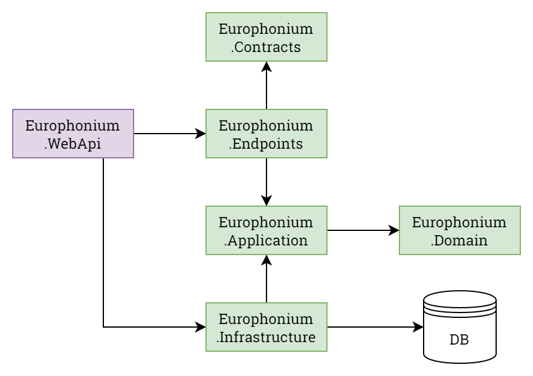
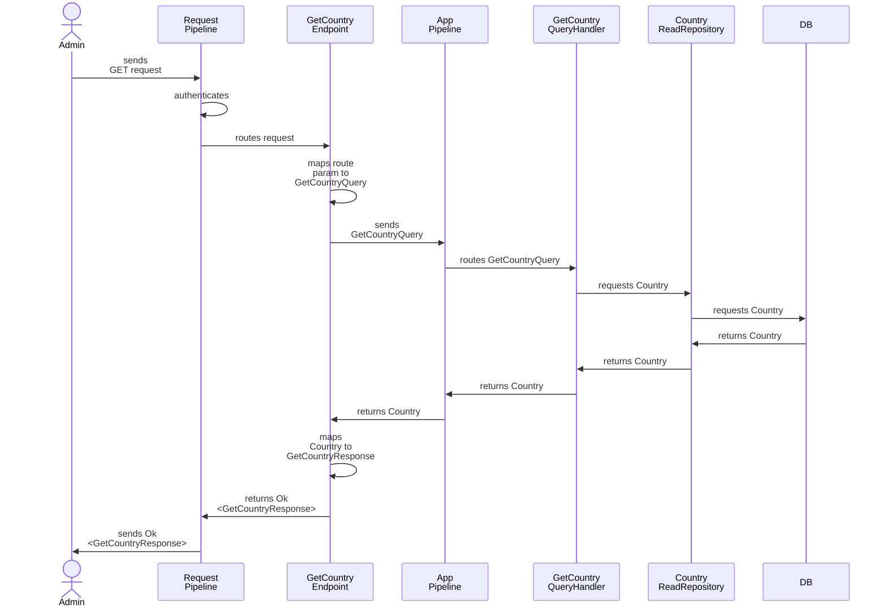
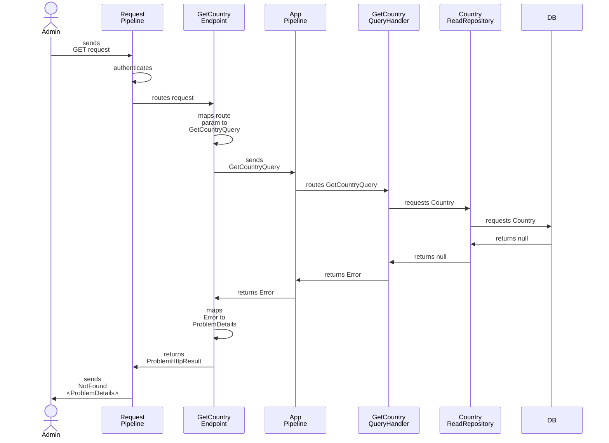

# System design

This document outlines the key design decisions for the *Europhonium* project.

- [System design](#system-design)
  - [System architecture](#system-architecture)
  - [Third-party libraries](#third-party-libraries)
  - [Uniform workflow](#uniform-workflow)
    - [1. HTTP request](#1-http-request)
    - [2. Security](#2-security)
    - [3. Endpoint](#3-endpoint)
    - [4. Query/command mapping](#4-querycommand-mapping)
    - [5. Entering application pipeline](#5-entering-application-pipeline)
    - [6. Handling the query/command](#6-handling-the-querycommand)
    - [7. Returning through application pipeline](#7-returning-through-application-pipeline)
    - [8. Response mapping](#8-response-mapping)
    - [9. Returning through request pipeline](#9-returning-through-request-pipeline)
    - [10. HTTP response](#10-http-response)
  - [Example workflow: Get Country, happy path](#example-workflow-get-country-happy-path)
  - [Example workflow, Get Country, sad path, country not found](#example-workflow-get-country-sad-path-country-not-found)
  - [Acceptance Test Driven Development (ATDD)](#acceptance-test-driven-development-atdd)

## System architecture

The system will be composed of a .NET web API project (containing the executable) and five .NET class libraries, following the Clean Architecture pattern. The assembly dependencies are shown in the diagram below.

|         |
|:----------------------------------------------------------------------------:|
| *Europhonium* assembly architecture (arrows indicate explicit dependencies). |

The assemblies have the following responsibilities:

| Assembly                     | Responsibility                                                                                           |
|:-----------------------------|:---------------------------------------------------------------------------------------------------------|
| `Europhonium.WebApi`         | Application configuration and startup.                                                                   |
| `Europhonium.Contracts`      | Contains web API request and response types.                                                             |
| `Europhonium.Endpoints`      | Contains endpoint classes.                                                                               |
| `Europhonium.Application`    | Contains application query/command types, their handlers, pipeline behaviours, and service abstractions. |
| `Europhonium.Infrastructure` | Contains service implementations (e.g. for database interactions).                                       |
| `Europhonium.Domain`         | Contains domain entities, value objects, errors, business rules, etc.                                    |

## Third-party libraries

The system will use the following 3rd party libraries prominently:

- FastEndpoints
- ErrorOr
- MediatR
- EF Core
- Dapper

## Uniform workflow

This project uses the REPR pattern and Railway-Oriented Programming, with a uniform workflow for every use case. The general workflow is outlined below:

### 1. HTTP request

The client sends an HTTP request to the API. If the client needs to send data in the request body, they use a request data structure defined in the `Europhonium.Contracts` assembly and exposed as part of the API documentation.

The HTTP request must have an `"X-Api-Key"` header containing the *admin API key* or the *public API key*.

### 2. Security

The request pipeline performs an API key security check. If the check fails, it sends an `Unauthorized` response to the client. Otherwise, it routes the request to its specific endpoint class.

### 3. Endpoint

The endpoint classes are defined in the `Europhonium.Endpoints` assembly. Each endpoint exposes an `ExecuteAsync` method that returns a `Results<TResponse, ProblemHttpResult>` discriminated union, where `TResponse` is the happy path HTTP response for the use case.

### 4. Query/command mapping

When the endpoint's `ExecuteAsync` method is invoked, it maps the request data to a specific query or command object. A query/command type implements `IRequest<ErrorOr<TResult>>`, where `TResult` is the happy path result.

The endpoint dispatches the query/command to the application pipeline.

### 5. Entering application pipeline

If the query/command type requires any initial checks before it is handled, they are performed here by an application pipeline behaviour.

The application pipeline passes the query/command to its designated query/command handler.

### 6. Handling the query/command

The query/command handler attempts to handle the query/command. If it needs to interact with the database, it does so using a repository or gateway abstraction defined in the `Europhonium.Application` assembly and implemented in the `Europhonium.Infrastructure` assembly.

If the handler succeeds, it returns the result to the pipeline. Otherwise, it returns an `Error`.

### 7. Returning through application pipeline

The application pipeline returns the `ErrorOr<TResult>` to the endpoint.

### 8. Response mapping

If the endpoint class receives the happy path result from the application pipeline, it maps the result to a response and returns it. If the endpoint receives an `Error`, it maps the result to a `ProblemHttpResult` and returns it.

### 9. Returning through request pipeline

If any post-processing needs to be done to the HTTP response, it is performed here.

### 10. HTTP response

Finally, the API sends the HTTP response to the client.

## Example workflow: Get Country, happy path

## Example workflow, Get Country, sad path, country not found

## Acceptance Test Driven Development (ATDD)

The system will be developed using Acceptance Test Driven Development, as follows:

1. Choose a feature from the backlog.
2. Write its failing happy and sad path acceptance tests using Gherkin syntax, interacting with a test server via HTTP requests.
3. Write its failing subcutaneous tests, interacting with a test server's application pipeline using the feature's query/command type.
4. Implement the feature using unit tests (Test Driven Development).
5. Ensure the subcutaneous tests pass.
6. Ensure the acceptance tests pass.
7. The feature is completed.

Any tests that need the database will use a real SQL Server database running in a test container.

Additionally, all five class library projects will have coding standards enforced through architecture tests.
